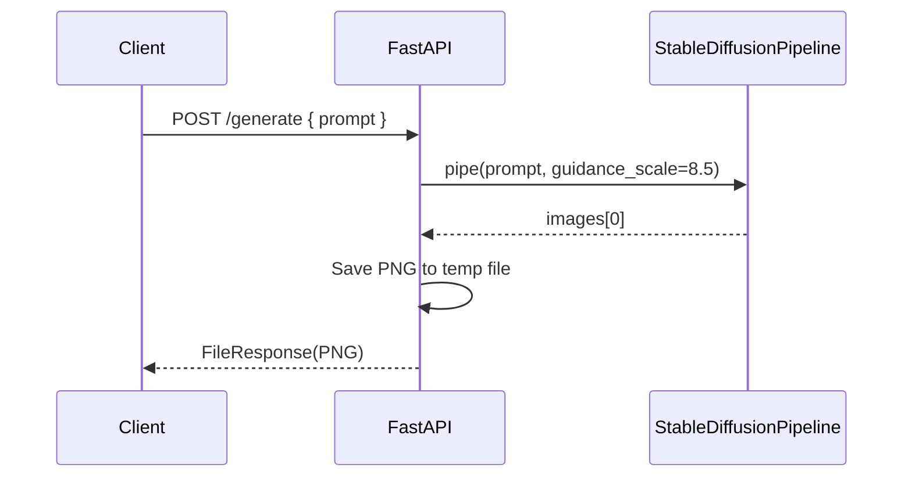

# Stable Diffusion - Text-to-Image Generator

> **Status:** Single-purpose demo repository containing:
> - A **FastAPI** backend that exposes a REST API to generate images with Stable Diffusion
> - A **local Tkinter/CustomTkinter UI** that generates and displays an image
> 
> **Important:** The repository does **not** include Docker, CI/CD, database setup, deployment configuration, cloud infrastructure, monitoring/alerting, or security hardening beyond basic API exception handling. Sections below explicitly call out what is present vs. not implemented.

---

## 1. Project Overview

### Project name
**Stable Diffusion - Text-to-Image Generator**

### One-line summary
Generate images from natural-language prompts using **Stable Diffusion** via a simple **FastAPI** service and a local UI.

### Business problem solved
Create an accessible way to turn text prompts into generated images without requiring users to understand the model internals.

### Why this project exists
Provide a minimal-but-working reference implementation for:
- Loading a Stable Diffusion pipeline (Hugging Face model hub or a local model path)
- Exposing an HTTP endpoint to generate images
- Offering a basic desktop UI for experimentation

### Key features
- **REST API** endpoint:
  - `GET /health` health check
  - `POST /generate` generates an image from a prompt
- **Model configuration via environment variables**:
  - `MODEL_PATH` selects the model (HF repo id or local path)
  - `DEVICE` selects compute backend (`cpu` by default)
- **Local desktop UI** script (Tkinter + CustomTkinter)
- Produces generated images and returns them as PNG

### Screenshots
Placeholders (no screenshots in the repository):

- Dashboard: 
- Login page: 
- Registration page: 
- Admin panel: 
- API testing: 
- Monitoring dashboard: 
- Deployment screenshots: 
- CI/CD screenshots: 

### Demo URL
Not deployed in this repo.

### Repository URL
Not provided in this repository; local path assumed.

---

## 2. Project Highlights

### Technical achievements (what this repo demonstrates)
- **FastAPI** service with typed request model (`pydantic.BaseModel`)
- Stable Diffusion pipeline loading via **Diffusers** (`StableDiffusionPipeline.from_pretrained`)
- Image generation wrapped in **`torch.no_grad()`**
- Image output streamed back as **`FileResponse`** from a temporary directory

### Scalability considerations (not fully implemented)
- Model loading happens at import time / startup (`pipe = StableDiffusionPipeline...`) which is efficient for repeated requests, but:
  - There is no concurrency limiting, job queue, or worker pool.
  - CPU inference can be slow; parallel requests may block.

### Security implementations (present vs. missing)
Present:
- API errors return HTTP 500 with a generic message.

Missing (not implemented):
- Authentication/authorization (no JWT/session)
- Rate limiting
- Input validation beyond `prompt: str`
- CORS configuration
- Secrets management
- Threat modeling / OWASP controls

### Performance optimizations (present vs. missing)
Present:
- `torch.no_grad()` reduces memory usage.

Missing (not implemented):
- Caching, batching, async workers, GPU support guidance, queueing, response streaming optimizations, or load test results.

### Production-grade features (not implemented)
- Dockerization
- Reverse proxy setup
- SSL/domain configuration
- Monitoring/logging stack
- CI/CD pipeline

---

## 3. System Architecture

### High-level architecture diagram (Mermaid)

```mermaid
flowchart LR
  U[User Prompt] --> API[FastAPI /generate]
  API --> PD[Diffusers StableDiffusionPipeline]
  PD --> IMG[Generated Image (PIL)]
  IMG --> TMP[Saved to /tmp or TEMP]
  TMP --> RESP[FileResponse (PNG)]

  UI[Desktop UI: Tkinter] --> LOCAL[StableDiffusionPipeline]
  LOCAL --> UIIMG[Generated Image in UI + saved to Downloads]
```

### Request flow diagram



### Component interaction diagram
- **FastAPI app** (`app.py`) creates:
  - A global Stable Diffusion pipeline (`pipe`)
  - Endpoints `/health` and `/generate`
- **UI script** (`Stable_Diffusion.py`) loads its own pipeline in-process and renders output locally.

### Deployment architecture
Not implemented in this repo.

### Database architecture
Not applicable (no database exists in the repo).

---

## 4. Tech Stack

| Category | Technology | Purpose | Why it was chosen |
| -------- | ---------- | ------- | ----------------- |
| Backend | FastAPI | HTTP API | Simple, typed APIs, ASGI-ready |
| Validation | Pydantic | Request schema (`GenerateRequest`) | Clear validation and developer ergonomics |
| Model runtime | Diffusers (`StableDiffusionPipeline`) | Stable Diffusion inference | Standard library for Stable Diffusion models |
| Compute | PyTorch (`torch`) | Inference + tensor ops | Diffusers is built on PyTorch |
| Serving | Uvicorn | ASGI server | Common FastAPI runtime |
| Desktop UI | Tkinter + CustomTkinter | Local prompt entry + image preview | Quick local experimentation |
| Image handling | Pillow (`PIL`) | Convert and save images | Standard Python image utilities |
| Array handling | NumPy | Intermediate conversions | Compatible with Diffusers output |

---

## 5. Folder Structure

```text
Stable-diffusion/
├── app.py
├── Stable_Diffusion.py
├── requirements.txt
└── README.md
```

### File explanations
- `app.py`
  - FastAPI server.
  - Loads the Stable Diffusion pipeline at startup.
  - Implements `GET /health` and `POST /generate`.
- `Stable_Diffusion.py`
  - Desktop application using Tkinter + CustomTkinter.
  - Loads model pipeline and lets the user input a prompt.
  - Displays the generated image and saves it to the user’s Downloads folder.
- `requirements.txt`
  - Python dependencies for both backend and UI.
- `README.md`
  - This documentation.

---

## 6. Prerequisites

### OS requirements
- macOS / Linux recommended (Tkinter UI requires a local desktop environment)
- CPU-only usage is supported via default `DEVICE=cpu`.

### Software requirements
- Python 3.9+ (commonly compatible; adjust if your environment requires)
- Python packages listed in `requirements.txt`
- Stable Diffusion model availability:
  - Hugging Face model ID (default) OR
  - Local model directory (via `MODEL_PATH`)

### Accounts required
- If using Hugging Face Hub models: Hugging Face access may be required depending on the chosen model.

### Cloud requirements
- None in this repo.

---

## 7. Local Development Setup

### Step 1: Clone
